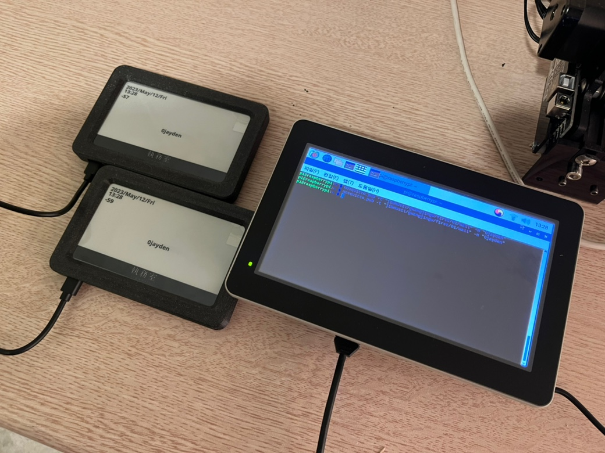
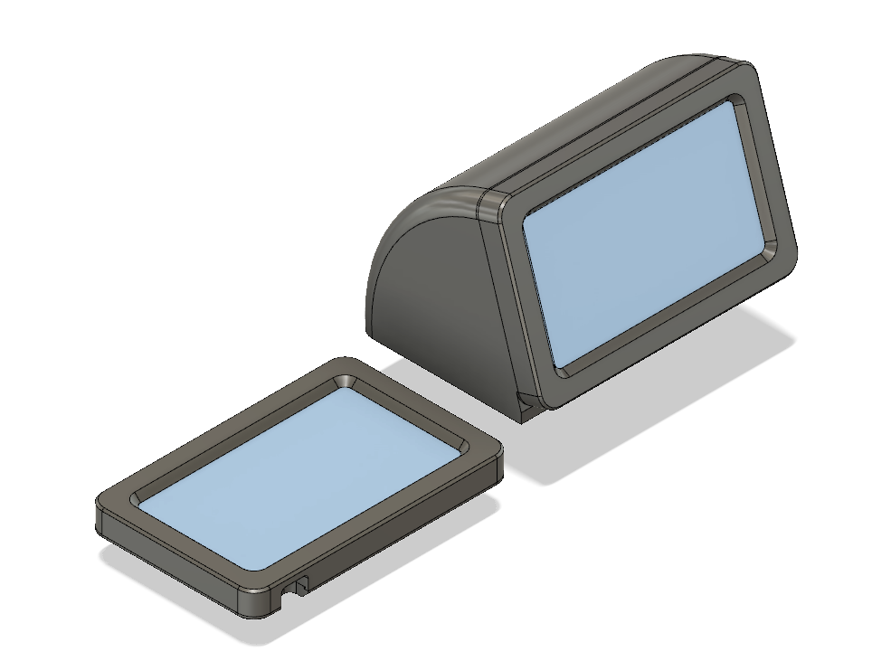
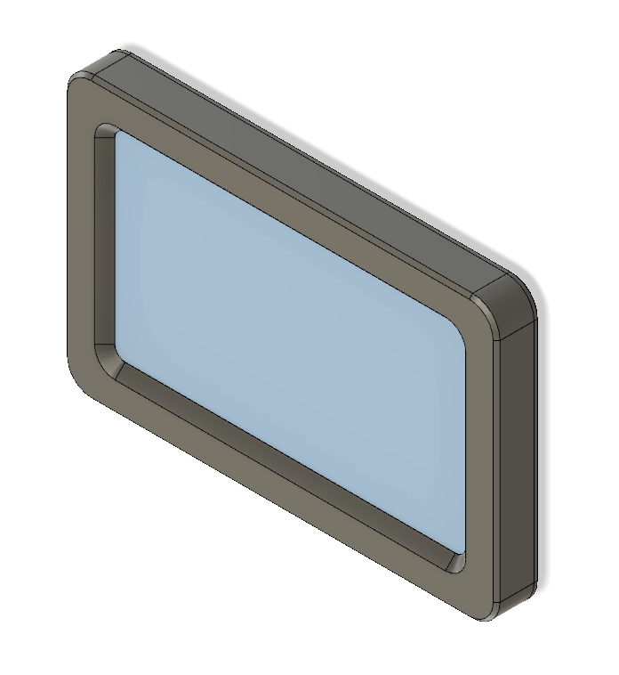
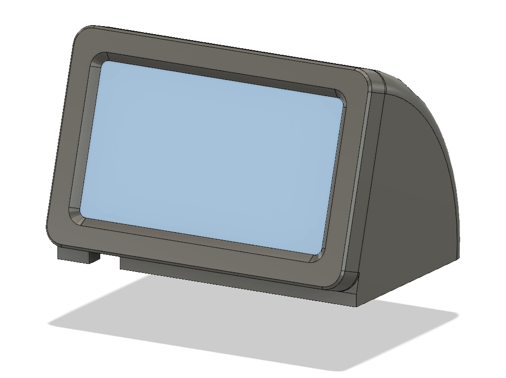

# EPD 좌석 명찰
Seat management system using ESP32 and E-ink display
Lilygo 4.7inch를 이용한 전자잉크 좌석 관리 시스템

# 개요

대량의 점유 / 비점유 좌석을 갖춘 공간을 관리할때에 발생하는 저시인성 문제, 관리 리스크 그리고 일반 사용자로 하여금 불필요한 요소로 여겨지는 등의 문제를 개선해보고자 개발하였습니다.

기존의 좌석별 명찰 시스템의 경우 사용자의 사용 시나리오상 추가적인 좌석 확인과정을 거쳐야하는 피곤함이 있었습니다.
외부와 분리된 공간의 정적인 이미지를 깨트리지 않으면서 자연스럽게 사용자가 명찰과 시간, 날씨 등을 체크 할 수 있는 시스템을 구성해보고자 하였습니다.

관리자는 서버를 통해 MQTT로 모든 명찰을 실시간으로 제어할 수 있으며, 연결 상태가 확인 가능한 네트워크 시간 정보를 표시해주고 와이파이 연결 상태를 체크 할 수 있습니다.

# 구성

**Comfile TECHNOLOGY CPi-A070WR**
컴파일 테크놀로지에서 제작한 7inch 산업용 라즈베리파이 패널입니다.
야외와 밝은 실내 사용에 적합하도록 고휘도 옵션과 패널이 탑재되어 있으며, RS232, RS485, I2C 통신이 가능한 단자를 추가로 탑재하여 산업용 장비 및 외부 장비와 쉽게 연결 할 수 있습니다.
장비에서 제공하는 GPIO포트와 전원 공급부에 ESD보호 및 서지방지 회로가 탑재되어 장기간 안정적으로 동작하여야 하는 서비스에 적절합니다.

**4.7inch Lilygo battery type(ESP32-WROVER)**
중국의 IoT 장비 전문업체 Lilygo의 4.7inch E-ink Display가 탑재된 ESP32개발보드입니다.
자체 배터리 보호회로가 내장되어 있어 장기간 운용되는 저전력 E-ink 어플리케이션에 추가적인 가공없이 바로 사용 가능합니다.

**Wallpad dock**
4.7inch Lilygo 보드에 맞추어 제작된 벽 부착형 도크입니다.
후면부 커넥터 연결단자를 벽에 안보이게 매립 가능하도록 설계되었습니다.

**DeskTop dock**
4.7inch Lilygo 보드에 맞추어 제작된 책상 부착형 도크입니다.
일반적인 책상보다 조금 더 가까운 책상 환경에 맞추어 화면 시인성을 위해 전면 경사도를 17도 가량으로 설정되어있습니다.
하단부 커넥터 연결부분이 뚫려있어 필요시 커넥터 노출없이 설치 가능하도록 설계되었습니다.
후면 커버의 공간을 확보하여 유선상황이 아닌 배터리 연결 상황에서도 사용 가능하도록 하였습니다.

# To-Do

- 데이터 변경부분 화면 초기화 코드 추가수정
- 이미지 / 한글 폰트 삽입 기능 제작
- 전체 화면 디자인 수정
- 좌석 관리 관리자단 프로그램 개발
- 집무실 디자인과 톤앤매너 통일

- DeskTop dock에 사용자 도구 추가
  - 외부 날씨 및 일출/일몰 표시기능 추가
  - Time Timer, 모바일 연동 등 업무 편의기능
  - 상단 물리버튼 제공

- Wallpad dock 시인성 강화
  - 추가폰트 삽입 및 강조표현
  - 내부 형태에 맞춘 매립형 구조 변경
